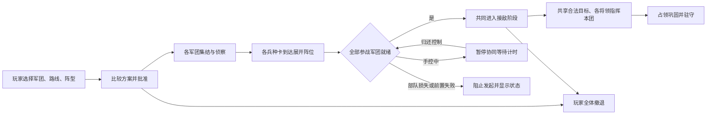

# 最终决战：双武器与军团联合作战

> 历史归档：正文只描述当时版本，旧“当前/下一步/待验证”不再授权执行。现行规则与进展从[文档入口](../../README.md)读取。

> 炮车规则已被2026-09-20最新修订替代：最终决战仅20–80伤害、420固定射程、无限弹的导弹普通攻击，无备用炮和组织压制。本文旧双武器数值与对局/性能数据属于历史版本；当前规则见FIVE_LEGIONS_DESIGN_20260919.md，新验证见ARTILLERY_REVISION_20260920.md。

> 当前规则与数值见 [FIVE_LEGIONS_DESIGN_20260919.md](FIVE_LEGIONS_DESIGN_20260919.md)。本文保留004版历史细节：下文256人口、25护甲及基于25甲的伤害推导均非现行数值。现行每方300名士兵另加5名将领，装甲突击基础护甲15；规模、将领、编成、交接、撤退与导弹延迟以新文档为准。
范围：WS-MAINT-20260919-004，D-035。本文描述本轮实现；验证结论见 COMBINED_ARMS_VERIFICATION_20260919.md。所有工程证据为 SIMULATED，真人乐趣与胜率研究 OPTIONAL_NOT_RUN。

## 1. 单位数值与经济代价

| 单位 | 生命 | 基础护甲 | 每名招募补给 | 主要用途 |
|---|---:|---:|---:|---|
| 侦察 | 120 | 4 | 1 | 观察、识别、伴随主力射击，不能占点 |
| 突击 | 300 | 10 | 2 | 低成本占点与持续火力 |
| 装甲突击 | 400 | 25 | 5 | 正面承受伤害、突破与占点 |
| 火炮 | 130 | 3 | 4 | 有限远程导弹、弹尽普通炮 |

以上仅覆写最终决战卡牌，蓝红相同；旧四关不随本轮涨血。移动速度、突击/装甲攻击30与190射程不变。OPEN区域装甲速度×1.1、攻击×1.2；没有额外0.75受击倍率。

每方48→256满编无损扩军需632补给：4×(13×1+12×2+13×5+14×4)。60补给可买12名装甲，或30突击，或一次区域轰炸。人口256、库存300、默认预留12、阵营每固定模拟秒最多5人、每团最多2人的规则不变。每秒收入显示为20秒结算收入折算，不是逐秒实际到账；相邻两个秒桶边界可很快先后出现两批新兵。

### 护甲造成的兵种关系

按无地形、无驻守、满组织、无遮挡且已在射程内的单发命中计算：侦察24对25甲只有最低1伤害；突击30对25甲为5；装甲30打10甲突击为20。因此新装甲不仅多100生命，也强力克制轻武器。纯突击单车击破满血装甲需80次命中，而装甲击破满血突击需15次；这是机制推导，不是实战胜率。

火炮普通炮对25甲为15，导弹为10～115（均值62.5），因此侦察提供视野、火炮削弱装甲、突击占点的组合更有价值。25固定护甲与装甲较高费用5补给是本轮用户指定标准；若实际体验出现“全装甲唯一解”，建议先评估专用反装甲能力和机动代价，不靠隐藏AI加成弥补。

## 2. 火炮的两种攻击

| 参数 | 导弹 | 普通炮 |
|---|---|---|
| 选择条件 | 还有导弹时优先且仅使用此武器 | 导弹耗尽自动切换 |
| 攻击力 | 70×均匀系数[0.5,2] | 40 |
| 基础射程 | 最小140、最大420，受地形影响 | 固定最大300、无最小距离 |
| 间隔 | 2秒 | 2秒 |
| 弹速 | 420 | 600 |
| 弹药 | 每人4枚 | 无限 |
| 前置 | 连续合法识别约1秒、停车展开2秒 | 无识别/展开门，仍须合法可见目标 |
| 组织压制 | 每发9 | 无 |

命中生命伤害=`max(1,发射时攻击力−命中时护甲)`，地形修正已计入发射时攻击力或命中时护甲，没有额外的受击倍率步骤。对25基础护甲、不计地形，导弹单发为10～115，均值62.5；普通炮为15。系数表示命中质量波动，本轮没有另加弹道偏移、独立脱靶概率或范围爆炸。弹丸一旦发出，切武器不会改变它的伤害。

系数采用实体ID和射击计数的确定性伪随机序列，不读取系统随机数或时间；相同局面与指令可以复盘。安全补给区内脱战5秒后，每人每2秒回1导弹后重新优先导弹，并恢复展开/最小射程要求。最后一发发射后的武器模式显示最多滞后1个模拟tick。

将领不再仅因有副武器的火炮导弹耗尽就带全团回补；组织、兵力和威胁仍能触发恢复。手控行军方向优先，将领可以分配集火但不能抢走路线。混合有弹/无弹成员分别选武器，整卡移动仍协调进行，不能按单车分别下战略路线。

## 3. 决策区操作

打开“参谋方案”，选择目标、参战军团、军团协同和展开阵型，再生成、比较并批准方案。只有批准后才下达任务。独立任务保留旧规则；协同必须至少两个完整、可调度军团，不能默默漏掉手控或不可用卡。

- **联合进攻**：选择非己方可占点。集结→侦察→展开→共同接敌→占领巩固。每张卡的接敌阶段等待所有参战卡展开完成；任一必要队伍失效阻止继续发起。共享等待预算按最远参与军团准备和行军计算。手控任一参与者时暂停共享集结时钟，归还后继续。
- **据点互援**：选择已属己方的补给点。多团部署、共同防守，共享合法集火及有限接近支援。目标不被争夺且阵位900内无可见敌持续10秒后结束接敌，再经原巩固阶段驻守。它是持续据点防守，不是临时救援后返回原目标。
- **全体撤退**：协同行动的撤退按钮影响该方案全部参与军团。撤退途中允许射程内自卫，不因局部敌人停车追击。玩家另给某团新目标会替换该团旧任务，并使旧联合进攻重新面对缺员/取消条件。

双方共享数值、交战和知识规则；这套参谋批准入口属于玩家决策，不代表红方也打开同一面板自动生成协同方案。红方仍由原有区域行动AI和支援策略驱动。

## 4. 三种展开阵型

阵型作用于各军团各兵种卡的目标阵位，不是给单辆车画自由站位。

| 阵型 | 实际位置规则 | 适合的游戏意图 | 代价 |
|---|---|---|---|
| 横队 | 军团横向间隔160 | 宽正面推进、多个部队相互掩护 | 覆盖宽，狭道会压缩 |
| 楔形 | 两翼越远越靠后，后移量=横偏移×0.8 | 中央先接触、两翼跟进 | 中央承担较多火力；两团时是对称双翼而无独立中央团 |
| 梯队 | 依次后移160、左右交错64 | 留出纵深、降低全部同时暴露 | 后排接敌和占点较慢 |

共同前向由参战起点均值指向目标。角色相对偏移：侦察前80，装甲基准，突击后72，火炮后220；侦察/展开阶段整体后移640，到达容差144。实际阵位通过导航网格校验；目标不可达时收拢到已批准路线上的可通行点，不穿墙摆阵。

路线先完整执行玩家最多3个有序途经点及方案侧翼轴，再在终末路段投影到展开位置；不能因为前半段靠近目标就忽略后面的绕行指令。联合进攻强调同一阶段开始，路程/障碍/射程差异仍使首次开火时间不同。

## 5. 将领的协作边界

参战军团在共同接敌阶段将各自当前合法目标纳入同一个候选池，按现有优先级选择正在攻击友军、具备攻击能力、受损和较近的敌人；每名将领仍只向自己部队提交经过校验的集火命令。不可见敌人不能进入候选池。

需要短程接近的AI分队复用256距离、丢失有效射击后3秒的追击与回位规则。手控路线和撤退优先，不会因盟友呼叫而被拉走。进入协同方案会停止参与军团自主选择下一战略点，完成后守住目标，后续方向由玩家决定。

展开途中若遭遇敌军，仍会自卫和停车交火；阶段门不会为了按时出击强行穿敌。若无法展开，可由玩家变更路线、批准新方案或整次撤退，任务超时与损失恢复仍由任务图处理。它不是能保证任何敌情下自动解围的全局最优规划器。

## 6. 从现代联合作战抽象到游戏战术

这里采用侦察屏护、火力与机动、纵深和预备队的通用游戏抽象，不构建现实军事训练模型。

| 战术配置 | 本轮可以怎样执行 | 玩家关键判断 |
|---|---|---|
| 侦察引导、火力先行 | 侦察优先方案＋横队；侦察合法识别，导弹先消耗敌生命/组织，装甲和突击占点 | 是否值得消耗4枚导弹、能否保住视野 |
| 双团集中突破 | 两团联合进攻＋横队/楔形，其余军团保持原独立任务 | 是否因集中而放弃野区收益；何时批准 |
| 多团纵深防守 | 己方关键外层点＋据点互援＋梯队，优先给前线团补员2人/秒 | 阵位间距与补给预算，何时转为反攻 |
| 正面牵制与野区转场 | 一团保留独立防守，其他至少两团经野区途经点联合进攻 | 自己选择跨线时机；系统不自动识别“佯攻成功” |
| 弹尽保持压力 | 普通炮继续战斗，另团保持侦察或轮换补给 | 保留导弹距离优势还是进入300距离持续作战 |
| 经济防线与预备队 | 只选部分军团进协同，其余团驻守关键收入点；储备40/60供医院/轰炸 | 战术支援与昂贵装甲扩员的取舍 |

## 7. 建议下一步，尚未实现

优先建议“主攻/掩护/预备”三个军团职责和触发式预备队（目标接敌、友军损失阈值、玩家确认），其次才是独立左右轴的夹击窗口。付费火力压制与免费导弹仍有收益重叠，可改为消耗额外弹药的齐射或区域压制，但需要独立平衡决定。本轮不把这些建议显示为已经能执行的按钮。

尚无真实包围角度评估、射界遮蔽分析、烟幕、诱敌、车体朝向装甲或弹道散布。本轮先建立可审计的阶段协同和可见反馈，再以实际体验决定复杂度。
