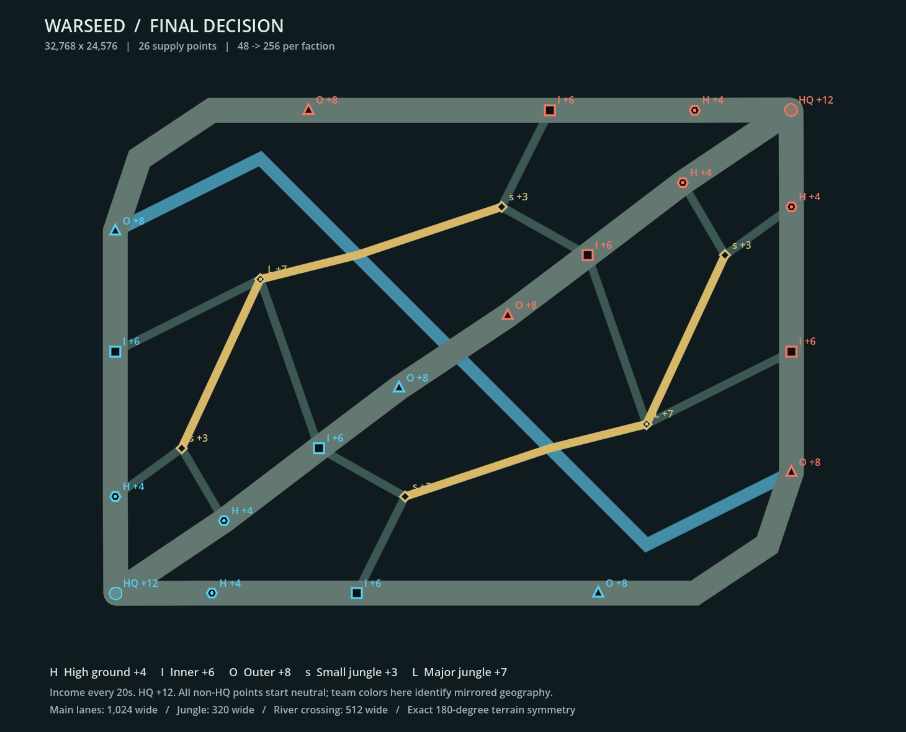

# 最终决战：独立发育对局

> 历史归档：正文只描述当时版本，旧“当前/下一步/待验证”不再授权执行。现行规则与进展从[文档入口](../../README.md)读取。

> 五军团版本以 [FIVE_LEGIONS_DESIGN_20260919.md](FIVE_LEGIONS_DESIGN_20260919.md) 为最新规则：每方60人开局、五军团各60、总上限300、战前自定兵种与将领。下文地图几何仍有效，旧四团规模与交付路径仅保留历史。

本文件描述 WS-MAINT-20260918-001 的发育对局及 WS-MAINT-20260919-001 的指挥反馈改进，替代 2026-09-17 满编开局规则和09-18旧补员/医院限制。09-19追加WS-MAINT-20260919-002野区道路串联、003自主交战修复及004双武器/军团协同。完整数值与战术审计见[现行数值文档](CURRENT_NUMBERS_AND_TACTICS_20260919.md)。对应新包为 WARSEED-Combined-Arms-20260919-final，旧交付包不含本轮改动。工程证据均为 **SIMULATED**；最终验收状态以工作项和状态文件为准。

## 地图与公平

世界为 **32768 × 24576**，1024 × 768 个32单位逻辑格。蓝总部在西南 `(2064,22544)`，红总部在东北 `(30704,2032)`。所有道路、阻挡格、节点属性和初始单位位置按 `(x,y) → (32768-x,24576-y)` 成对旋转。上路对应旋转后的下路，中路自身对称。

三条主路均按“蓝总部—蓝高地—蓝内层—蓝外层—红外层—红内层—红高地—红总部”排序。主路宽1024，六条横向野区通道宽320，新增两条320宽的纵向道路串联野区节点与河道，中部河道横穿三路、宽512。上下野区各有两个小补给点、一个大补给点。北侧道路为S(4864,16384)→L(8192,9216)→河道交汇(12288,8192)→S(18432,6144)；南侧按屏幕从左往右为S(14336,18432)→河道交汇(20480,16384)→L(24576,15360)→S(27904,8192)，两者严格180°对应。河道在上下交汇点之间仍可通行，野区转场不必绕主路；新道路贴图和导航使用同一typed资源。据点战略图新增rear↔major↔forward双向邻接。总览金色标注新道路、蓝色标注河道，仅是说明图强调色，实战沿用岩地道路纹理。总计26个节点：2座总部、18个主路点、6个野区点。平台、实际导航和道路贴图使用同一资源；没有装饰道路冒充可通行路线。

除总部外，所有点开局均中立。总览中的蓝红表示几何对应关系，实战颜色取当前控制权。外围点收益更高，鼓励向前争夺；高地点收益较低，提供安全补员后方。野区小点收益较低，但能连接主路，供侧翼转场和补员。大野区点提供更有价值的争夺目标。

双方使用相同单位数值、经济、人口上限和将领模板，AI只读取自己的合法知识。相同地形不意味着已经证明双方AI胜率完全相同。双方总部均6000生命；单方总部被毁即败，同tick互毁为平局。30分钟未决胜为平局，总部结局优先于超时。

## 发育与经济

10tick为1秒。初始每方48人、24补给，人口上限256、库存上限300。每方4个战团，每团有侦察、突击、装甲、火力4张卡；每张卡最大16人，每团最大64人。

| 分队 | 每团开局 | 单卡上限 | 每名招募补给 | 定位 |
|---|---:|---:|---:|---|
| 侦察车 | 3 | 16 | 1 | 前出观察、识别、接敌规避 |
| 突击车 | 4 | 16 | 2 | 占点、护卫、近距离交战 |
| 装甲突击 | 3 | 16 | 5 | 突破和正面作战；沿用现有装甲车与突破技能 |
| 导弹火力 | 2 | 16 | 4 | 后方火力支援，需要情报和弹药 |

| 节点 | 数量 | 每20秒收入 | 占领时间 | 控制范围半径 |
|---|---:|---:|---:|---:|
| 总部/指挥站 | 2 | 12 | 不可占领 | 512 |
| 高地 | 6 | 4 | 16秒 | 384 |
| 内层 | 6 | 6 | 12秒 | 352 |
| 外层 | 6 | 8 | 10秒 | 320 |
| 小野区点 | 4 | 3 | 6秒 | 224 |
| 大野区点 | 2 | 7 | 10秒 | 320 |

节点地图标签直接显示“+N/20秒”和折算“每秒收入”，扩展小地图显示每次收入，悬停显示每秒值。左侧常驻己方控制点折算收入/秒、上一完整模拟秒的实际补员/支援消耗及最低储备。收入仍按20秒结算，折算值不代表逐秒入账。

总部收入单独结算一次。争夺点暂停收入。以控制一侧三路的九个点加一个野区半区为例，每20秒收入为12+3×(4+6+8)+(3+7+3)=79。控制权变化没有额外一次性奖金。

扩员自动执行：每方每秒（10tick）最多招募5人，默认中路优先团2人、其他三团各1人。每团可配置0～2人/秒，合计不得超过5；0表示暂停补员，未用配额不结转。按实际增加人数付费，最低储备可设0～300，默认12，限制自动招募与将领自动技能；玩家支援可主动花费储备。只有己方无争夺补给点1400范围内、600范围无可见敌军且最近2秒未受伤的分队能够招募。每张卡、总人口、余额、每秒全局/军团配额和队列已承诺费用均由权威命令管线校验；拒绝不扣费。

选择“优先补给”后恢复默认1/1/1/2配额，该战团每秒最多2人，并在招募排序中获得2倍权重；取消优先则各团1人。左侧“补员方案”允许自定义0/2/1/2等组合，提交后按自定义配额执行。排序同时考虑当前人数和将领的当前性格：谨慎优先侦察，稳健均衡，缜密优先炮火，果决优先装甲。调换将领后立即按新将领偏好，不能依赖卡牌创建时的旧偏好。优先不是免费补给，也不是独占所有收入。

整卡覆灭后等待20秒，允许按相同单兵价格在本方总部重建，然后接回将领任务。残骸已经清理也能重建；手控卡不会被自动招募抢回。重建期间依然共享每秒配额、最低储备和256人口上限。

常规后勤是默认行为：安全补给区内脱战5秒后每人每秒恢复1生命、每2秒补充1发弹药；组织度另按现有恢复规则恢复。非侦察分队原地驻守5秒获得2点护甲，移动即失去驻守加成。野战医院提供更快的战时治疗。

## 将领自主性与玩家指挥

红蓝各有四位真正拥有独立Agent身份和分队任务的将领，分别负责上、中、下路和野区；红方路线按旋转对应分配。默认小军队会自行占点、扩员、推进、选择合法可见目标进行协同火力，并根据兵力、组织和弹药撤回安全补给点恢复。

谨慎将领给侦察更长前出时间、较早规避强敌；果决将领容忍更高敌我人数比，推进更快；其他将领在两者之间。火力分队向己方基地一侧后置展开。侦察到达本团目标后持续观察，不再独自横穿全图；侦察孤立遭遇威胁会规避，有640范围突击/装甲支援时可协同参战，威胁消失后返回指定扇区。占点后等待主力靠拢，避免前锋一到点就把后方火力甩开。

普通整卡移动/攻击移动属于临时微操，到达目标并稳定2秒后经统一命令交还将领AI；途中仍执行玩家路线。显式“接管/保持手控/停止”保持手控，直到按R或交还按钮；新移动指令会取消旧的待执行自动交还。

明确玩家目标保留其目标与途经路线，紧急恢复是临时行为，恢复后继续原策略。HOLD/撤离、新玩家指令和手控卡优先于自动目标。同tick的玩家将领命令覆盖自动目标。已批准的参谋任务图持有自己的战团，普通自动占点不改写它。

参谋区允许选择一个或多个完整战团，比较直接投入、侦察优先、侧翼推进，并在高级设置指定最多三个有序途经点、风险和补给预算。多战团方案并行，改令只替换涉及的将领；执行路径由真实导航生成。玩家决定何时集中兵力、从哪条路线投入，以及何时花费特殊支援。

## 特殊支援

大地图不再提供“补员/坚守/普通后勤”特殊卡。选择支援后点击地图，右键或取消键撤销选点。

| 支援 | 补给 | 半径 | 生效与持续 | 冷却 |
|---|---:|---:|---|---:|
| 空中侦察 | 20 | 1600 | 可投放黑暗区域，持续25秒刷新真实视野和移动敌人 | 60秒 |
| 导弹轰炸 | 60 | 900 | 双方可见4秒预警，落点造成180伤害，护甲减伤，敌我单位与建筑均受伤 | 120秒 |
| 野战医院 | 40 | 850 | 任意战区可通行地面（仅禁止敌方补给点控制半径内），持续60秒，每秒恢复附近友军8生命，不复活 | 90秒 |

导弹保留4秒倒计时，增加来袭轨迹、爆闪与扩散冲击波，落地后5秒保留影响区和HUD结算提示；提示不报告隐藏敌军伤亡。医院不能放在障碍物或地图外，敌方点控制半径也在输入和权威应用时复验；中立战区与己方区域均可。

侦察效果对敌方保密；导弹预警对双方公开；敌方只有看到医院区域才显示医院。医院与侦察的旧快照不随当前世界变化。敌方特殊支援由同一命令系统收费，侦察和轰炸只能基于合法知识判断目标；AI预留60补给再考虑特殊支援，轰炸回避当前可见友军。蓝方特殊支援由玩家决定。支援按钮按扣除已入队命令预留后的可用补给置灰，避免自动招募已承诺费用造成误导。

特殊支援与扩军共享货币：一次轰炸等价于60名侦察、30名突击、20名装甲或15名火力兵员。初始48人扩至256且无损时共需528补给。占点收入因此直接影响持续作战能力，过早花光补给会拖慢扩军。

## 界面与美术

主菜单默认“大地图对局”；旧四关保留在“战术行动”中。大地图每次重新以相同小编制开始，旧军团存档的兵力、装备、勋章不带入。战后保留对局记录和复盘，隐藏对新局无效的补兵/装备购买入口。

默认显示四个战团摘要，点击展开分队；直接显示性格招募偏好、配额与近期增员数。新兵生成后保留10秒绿色光圈（按模拟时间，暂停时冻结）。顶部战损/增援横幅和决策区均以将领军团具名，同军团同类告警合并，定位仍指向具体受影响部队。决策区只汇总当前重要异常，重复的同团同类告警合并，最多6项。战团遇袭、补给点争夺、失守和占领都有提示；失守点提示可以直接打开夺回方案；已占领和正在受威胁的己方据点定位战场，供玩家调兵防守。正常扩员不弹出16张补兵请求。

远景用固定屏幕尺寸的分队符号和人数替代难辨的小车，仍严格过滤敌方视野；近景显示正常世界比例的车辆。批量绘制使用真实位置包围盒，避免缩放或平移后错误裁剪。主地图与小地图共用节点符号：高地六边形、内层方形、外层三角，小野区菱形、大野区实心菱形。

蓝军延续冷色合金与青蓝灯线，红军延续楔形装甲、锈红与琥珀灯。地图岩地、道路与野区由重复纹理绘制；车辆保留炮口闪光、武器后坐、受击闪烁和残骸。地形装饰不读取隐藏战场状态。

## 验证与限制

专项覆盖逐格对称/可达、48人开局、扩员成本与人口、优先级和知识边界、区域支援生命周期、实渲缩放、双阵营自主指挥、手控优先及重建。交付要求完整发布门、真实窗口五档中英、独立导出包和最终整局重复验证通过；原始日志索引见工作项。

第一次发现局为18000tick超时平局，墙钟830.62秒；发现了驻守默认值、游离侦察和后期僵持。后续发现局出现的运行错误不记为通过。修正和最终对局结果另记工作项及试玩报告，不能将工程自玩描述为真人乐趣结论。性能门按D-028暂缓，玩法、确定性、公平知识、存档、UI和导出仍需验证。

## 09-19自主交战修复

玩家路线与将领集火独立，火力指令不接管移动；射程内自主选敌、停驻时最多256范围和3秒短追后回位、死亡领车即时替换。火力普通射击不再等待付费技能，阵营连续可见1秒即可识别，仍需2秒展开、弹药和最小射程140。当前火力卡普通弹是组织压制（生命伤害0），装甲卡与突击卡基础单位相同；详细实效和设计缺口以新数值文档为准。
